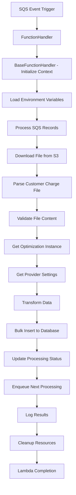

# AltaworxRevUploadCustomerCharge Lambda Function - Sequential Flow

## Overview
This document outlines the function-wise sequential flow for the AltaworxRevUploadCustomerCharge Lambda and its supporting components, based on the available codebase and typical AWS Lambda patterns for customer charge processing.

## 1. Lambda Entry Point

### Function: `FunctionHandler(SQSEvent sqsEvent, ILambdaContext context)`
**Location**: AltaworxRevUploadCustomerCharge.cs (Main Lambda)
**Purpose**: Main entry point for the AWS Lambda function
**Flow**:
1. Initialize KeySysLambdaContext from AWS Lambda context
2. Extract environment variables and settings
3. Process SQS event records
4. Handle exceptions and cleanup

## 2. Context Initialization

### Function: `BaseFunctionHandler(ILambdaContext context, bool skipOUSpecificLogic = false)`
**Location**: AWSFunctionBase.cs
**Purpose**: Initialize lambda execution context
**Flow**:
1. Create KeySysLambdaContext instance
2. Load OU-specific settings if not skipped
3. Return configured context

### Function: `KeySysLambdaContext(ILambdaContext context, bool skipOUSpecificLogic = false)`
**Location**: KeySysLambdaContext.cs (Inferred)
**Purpose**: Setup execution context with database connections and settings
**Flow**:
1. Initialize logger
2. Setup database connection strings
3. Load provider settings
4. Configure AWS credentials

## 3. Settings and Configuration

### Function: `LoadOUSettings(KeySysLambdaContext context)`
**Location**: AWSFunctionBase.cs
**Purpose**: Load organizational unit specific settings
**Flow**:
1. Query database for OU-specific configurations
2. Cache settings in context

### Function: `GetStringValueFromEnvironmentVariable(ILambdaContext context, EnvironmentRepository environmentRepo, string key)`
**Location**: AWSFunctionBase.cs
**Purpose**: Retrieve and validate environment variables
**Flow**:
1. Get environment variable value
2. Validate non-empty value
3. Throw exception if not configured

## 4. File Processing (S3)

### Function: `DownloadFileFromS3(KeySysLambdaContext context, string bucketName, string key)`
**Location**: S3Wrapper.cs (Inferred)
**Purpose**: Download customer charge file from S3
**Flow**:
1. Initialize S3 client with AWS credentials
2. Create download request
3. Download file to local/memory stream
4. Return file content

### Function: `ProcessCustomerChargeFile(KeySysLambdaContext context, string fileContent)`
**Location**: CustomerChargeListFileService.cs (Inferred)
**Purpose**: Parse and validate customer charge file
**Flow**:
1. Parse file content (CSV/Excel)
2. Validate file format and headers
3. Transform data to customer charge objects
4. Return list of customer charges

## 5. Database Operations

### Function: `GetOptimizationInstance(KeySysLambdaContext context, long instanceId)`
**Location**: OptimizationInstanceRepository.cs (Inferred)
**Purpose**: Retrieve optimization instance details
**Flow**:
1. Execute stored procedure `GET_OPTIMIZATION_INSTANCE`
2. Map database results to OptimizationInstance object
3. Return instance details

### Function: `GetInstance(KeySysLambdaContext context, long instanceId)`
**Location**: AWSFunctionBase.cs
**Purpose**: Get optimization instance from database
**Flow**:
1. Connect to central database
2. Execute stored procedure with instance ID
3. Read results using `InstanceFromReader`
4. Return OptimizationInstance object

### Function: `GetQueue(KeySysLambdaContext context, long queueId)`
**Location**: AWSFunctionBase.cs
**Purpose**: Retrieve optimization queue details
**Flow**:
1. Connect to central database
2. Query OptimizationQueue table
3. Map results using `QueueFromReader`
4. Return OptimizationQueue object

### Function: `SaveCustomerCharges(KeySysLambdaContext context, List<CustomerCharge> charges)`
**Location**: CustomerChargeRepository.cs (Inferred)
**Purpose**: Bulk insert customer charges to database
**Flow**:
1. Create DataTable from customer charges
2. Setup column mappings
3. Execute SqlBulkCopy operation
4. Handle exceptions and rollback if needed

### Function: `SqlBulkCopy(KeySysLambdaContext context, string connectionString, DataTable table, string tableName)`
**Location**: AWSFunctionBase.cs
**Purpose**: Perform bulk insert operation
**Flow**:
1. Open SQL connection
2. Configure SqlBulkCopy with timeout and batch size
3. Apply column mappings if provided
4. Execute bulk insert
5. Handle SQL exceptions

## 6. Settings Management

### Function: `GetGeneralProviderSettings(KeySysLambdaContext context, int serviceProviderId)`
**Location**: SettingsRepository.cs (Inferred)
**Purpose**: Retrieve service provider settings
**Flow**:
1. Query ServiceProvider table
2. Get authentication and configuration details
3. Return provider settings object

### Function: `GetServiceProvider(string connectionString, int serviceProviderId)`
**Location**: ServiceProviderCommon.cs
**Purpose**: Get service provider details
**Flow**:
1. Connect to database
2. Query ServiceProvider table with filters
3. Map results to ServiceProvider object
4. Return provider details

## 7. Queue Management

### Function: `EnqueueNextProcessing(KeySysLambdaContext context, SqsValues sqsValues)`
**Location**: SqsService.cs (Inferred)
**Purpose**: Send message to next processing queue
**Flow**:
1. Create SQS client with AWS credentials
2. Build message with attributes
3. Send to specified queue
4. Handle response status

### Function: `EnqueueOptimizationQueue(KeySysLambdaContext context, long instanceId)`
**Location**: OptimizationQueueRepository.cs (Inferred)
**Purpose**: Add items to optimization queue
**Flow**:
1. Create queue entries for processing
2. Insert into OptimizationQueue table
3. Set processing status and timestamps

## 8. SQL Query Execution

### Function: `ExecuteStoredProcedureWithRowCountResult(Action<string, string> logFunction, string connectionString, string procedureName, List<SqlParameter> parameters, int timeoutSeconds)`
**Location**: SqlQueryHelper.cs (Inferred)
**Purpose**: Execute stored procedures with logging
**Flow**:
1. Create SQL connection and command
2. Add parameters to command
3. Execute stored procedure
4. Log results and row counts
5. Return execution results

## 9. Logging and Monitoring

### Function: `LogInfo(KeySysLambdaContext context, string desc, object detail = null)`
**Location**: AWSFunctionBase.cs
**Purpose**: Structured logging for lambda execution
**Flow**:
1. Format log message with caller information
2. Add execution context details
3. Write to CloudWatch logs
4. Include timestamp and severity

## 10. Cleanup and Finalization

### Function: `CleanUp(KeySysLambdaContext context)`
**Location**: AWSFunctionBase.cs
**Purpose**: Release resources and cleanup
**Flow**:
1. Dispose database connections
2. Clear cached settings
3. Release AWS service clients
4. Log cleanup completion

### Function: `AwsCredentials(KeySysLambdaContext context)`
**Location**: AWSFunctionBase.cs
**Purpose**: Create AWS credentials for service access
**Flow**:
1. Get AWS access key from settings
2. Decode secret access key using Base64Service
3. Return BasicAWSCredentials object

## Complete Sequential Flow

## Key Error Handling Points

1. **File Processing Errors**: Invalid format, missing files, S3 access issues
2. **Database Errors**: Connection failures, constraint violations, timeout issues  
3. **Queue Errors**: SQS message processing failures, dead letter queue handling
4. **Validation Errors**: Data format issues, business rule violations
5. **AWS Service Errors**: Credential issues, service availability, rate limiting

## Configuration Dependencies

- **Environment Variables**: Database connections, AWS settings, queue URLs
- **Database Tables**: OptimizationInstance, OptimizationQueue, CustomerCharge, ServiceProvider
- **AWS Services**: S3 (file storage), SQS (message queuing), CloudWatch (logging)
- **External Services**: Provider APIs for validation and updates

## Performance Considerations

- **Batch Processing**: SqlBulkCopy for efficient database operations
- **Connection Pooling**: Reuse database connections where possible
- **Timeout Management**: Appropriate timeouts for different operations
- **Memory Management**: Streaming large files to avoid memory issues
- **Retry Logic**: Polly retry policies for transient failures